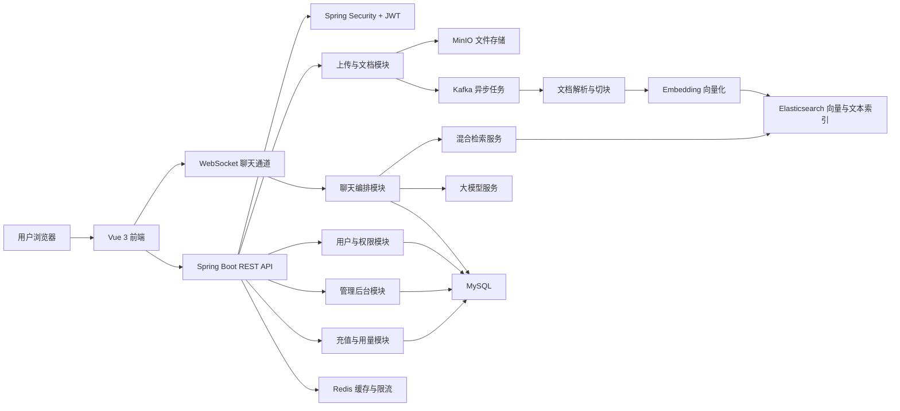
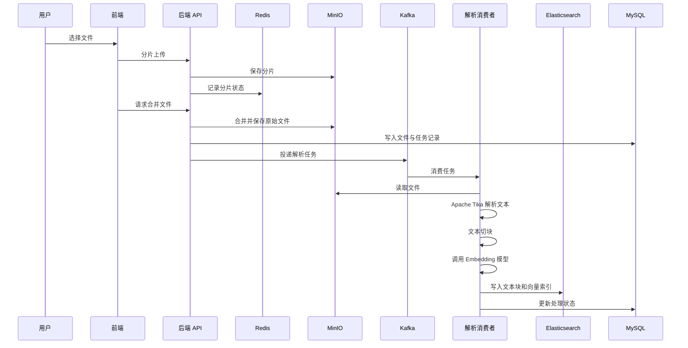
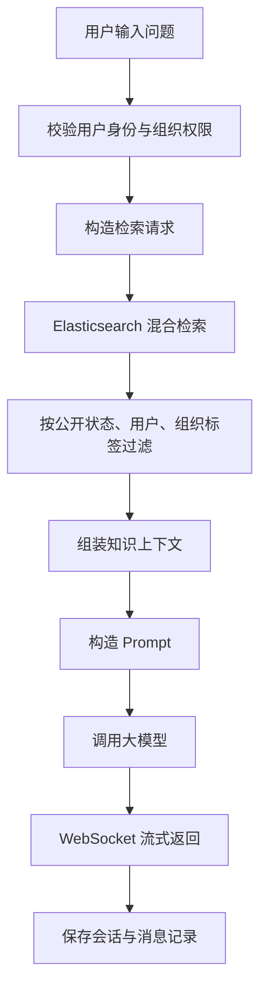

# KnowFlow 项目介绍

快速部署本项目支持本地源码部署：复制 .env.example 为 .env，修改 MySQL、Redis、MinIO、Elasticsearch、JWT 和模型 API 等配置；再启动 MySQL、Redis、MinIO、Elasticsearch 8.x、Kafka；最后分别启动 Spring Boot 后端和 Vue 前端。
详细步骤见 [docs/deployment.md](docs/deployment.md)。

## 1. 项目概述

KnowFlow 是一个面向企业和个人资料管理的 AI 知识库系统。它解决的不是“做一个聊天框”这么简单的问题，而是把分散在 PDF、Word、TXT 和内部资料中的文档，整理成一个可检索、可问答、可按权限访问的知识库。

项目的核心是 RAG（增强检索生成），也就是先从知识库中检索相关资料，再让大模型基于这些资料生成回答。用户上传文档后，系统会完成文件存储、文本解析、内容切块、Embedding 向量化和 Elasticsearch 索引写入；用户提问时，后端先召回相关片段，再把片段和问题一起交给大模型生成回答。这样既能降低大模型“自由发挥”的概率，也能让用户回到原始资料中核对来源。

我在这个项目中更关注的是“怎么把 AI 能力放进一个真正可运行的业务系统里”。因此，除了 RAG 主链路，我还围绕文档管理、权限隔离、异步任务、流式问答、用量控制、充值计费和后台管理做了比较完整的工程化设计。这个过程给我的感受很强烈：AI 项目最迷人的地方不单是模型本身，而是当它和权限、文件、搜索、缓存、消息队列、成本控制这些现实问题撞在一起时，整个系统突然变得又复杂又有生命力。

## 2. 项目定位

KnowFlow 可以看作一个企业级 RAG 知识库平台，主要处理下面几类问题：

- 企业内部文档数量多、格式杂，传统目录和关键词搜索效率不高。
- 大模型无法直接读取企业私有资料，容易生成过时或不准确的回答。
- 不同部门、团队和用户之间，需要清楚地隔离文档访问权限。
- 大文件上传、解析、向量化、写索引都比较耗时，不能一直占用 HTTP 请求。
- AI 调用有成本，需要配合额度、用量统计、限流和充值体系。

适用场景包括企业知识问答、内部文档检索、技术资料助手、课程资料问答、面试资料库、客服知识库等。相比单纯的 Demo，KnowFlow 更像一个把 AI 能力接入真实业务系统的练兵场。

## 3. 我的主要工作

在项目中，我主要参与后端核心模块的设计与实现，并围绕 RAG 主链路做了多轮优化。我的工作可以概括为以下几个方向：

- 设计知识库文档处理流程，包括文件分片上传、断点续传、文件合并、文档解析、文本切块、向量化和索引写入。
- 使用 Kafka 拆分耗时任务，把文档解析、Embedding 调用和 Elasticsearch 写入从用户请求中解耦出来。
- 设计基于用户、角色、组织标签和文档属性的权限过滤逻辑，保证检索阶段就完成访问控制。
- 实现混合检索链路，将关键词检索和向量检索结合，用于提高 RAG 问答的召回质量。
- 参与 WebSocket 流式聊天链路，让用户可以边等待边看到大模型输出结果。
- 完善用户认证、管理后台、用量统计、限流、充值订单和模型供应商配置等业务模块。
- 梳理异步任务状态、失败重试和最终一致性问题，减少文档处理过程中的“半成功”状态。

这个项目让我明显意识到，后端开发并不是把接口写通就结束了。真正麻烦的地方往往出现在链路很长、组件很多、失败情况特别碎的时候：文件已经上传成功但消息投递失败怎么办？向量化成功但 ES 写入失败怎么办？用户刚好没有权限但检索结果已经被送进大模型怎么办？这些问题看起来不酷，但它们才是系统能不能站得住的关键。

## 4. 技术栈

### 4.1 后端技术栈

| 类型 | 技术 |
| --- | --- |
| 开发语言 | Java 17 |
| 后端框架 | Spring Boot 3.4.2 |
| Web 框架 | Spring MVC、WebFlux |
| 安全认证 | Spring Security、JWT |
| ORM | Spring Data JPA |
| 数据库 | MySQL 8.0 |
| 缓存 | Redis |
| 搜索引擎 | Elasticsearch 8.10.0 |
| 消息队列 | Apache Kafka |
| 文件存储 | MinIO |
| 文档解析 | Apache Tika |
| 实时通信 | WebSocket |
| AI 接入 | DeepSeek API、本地 Ollama、Embedding 模型 |
| 构建工具 | Maven |
| 部署支持 | Docker、Nginx、Shell 脚本 |

### 4.2 前端技术栈

| 类型 | 技术 |
| --- | --- |
| 前端框架 | Vue 3 |
| 开发语言 | TypeScript |
| 构建工具 | Vite |
| UI 组件库 | Naive UI |
| 状态管理 | Pinia |
| 路由 | Vue Router、Elegant Router |
| 样式方案 | UnoCSS、SCSS |
| 图标 | Iconify |
| 包管理 | pnpm |

### 4.3 中间件职责

| 中间件 | 在项目中的作用 |
| --- | --- |
| MySQL | 保存用户、角色、文档、会话、订单、用量、配置等业务数据 |
| Redis | 缓存 Token、上传分片状态、组织标签、限流计数和会话状态 |
| Elasticsearch | 保存文档文本块、向量和元数据，支撑关键词检索与语义检索 |
| Kafka | 承接文件解析、向量化、索引写入等异步任务 |
| MinIO | 保存用户上传的原始文件、预览文件和迁移文件 |

## 5. 总体架构设计

KnowFlow 采用前后端分离架构。前端负责页面交互、状态展示和聊天体验；后端负责认证授权、业务处理、文档处理、AI 调用编排和数据持久化。后端代码按 `controller`、`service`、`repository`、`model`、`config`、`consumer` 等包拆分，整体上是典型的 Spring Boot 分层结构。

我对这个架构的理解是：前端不只是展示结果，后端也不只是转发请求。真正的核心在于后端要把“文件系统、搜索系统、AI 服务、权限系统、业务数据”协调起来，让用户看到的是一个稳定的知识库，而不是一堆分散组件临时拼出来的效果。

## 6. 核心业务流程

### 6.1 文档入库流程

文档入库是整个 RAG 链路的入口。一个文件从上传到可检索，大致会经历下面这些步骤：

一开始我最直观的想法是“上传后直接解析”，但真正梳理后发现这会让接口非常脆弱。大文件解析、向量化、索引写入都可能慢，而且任何一步失败都会拖住用户请求。后面我把上传和解析拆成两段：上传接口只负责接收、合并和创建任务，耗时逻辑交给 Kafka 消费者异步处理。这样前端能更快拿到响应，也能通过任务状态展示处理进度。

### 6.2 AI 问答流程

用户提问后，系统会先检索知识库，再组织上下文调用大模型：

这条链路的重点是检索质量和权限过滤。检索结果越贴近问题，大模型越容易回答到点上；权限过滤越靠前，越能避免把用户无权访问的文档送进模型上下文。做这一块时我的感受非常强烈：RAG 不是“把资料塞给模型”这么轻松，召回错了，模型会一本正经地错；权限错了，那就不是效果问题，而是安全事故。

### 6.3 权限控制流程

KnowFlow 通过用户身份、角色、组织标签和文档属性一起控制访问范围：

- 登录后签发 JWT，后续接口通过 Token 识别用户。
- 管理员接口按角色限制访问。
- 文档可以属于某个用户、某些组织标签，也可以设为公开。
- 普通用户查询知识库时，只能看到自己上传的文档、公开文档，以及自己组织标签范围内的文档。
- 管理员可以管理用户、组织标签、模型配置、邀请码、充值套餐和系统数据。

这里我没有把权限控制只放在页面展示层，而是尽量前移到后端查询和 ES 检索阶段。尤其在 RAG 场景中，如果无权文档已经进入 Prompt，即使最终页面不展示引用，也已经存在泄露风险。

## 7. 功能模块说明

### 7.1 用户认证与账户体系

系统提供注册、登录、刷新 Token、退出登录、退出全部设备等能力。认证基于 Spring Security 和 JWT，适合前后端分离项目。用户登录后，后端签发 Token，前端后续请求携带 Token，后端过滤器校验身份并把用户信息放入安全上下文。

这一块还包括个人信息查询、用户组织标签查询、主组织切换、用户用量查询和 Token 使用记录查询。它们看起来不算复杂，但后面的权限控制和用量计费都依赖这些基础数据。

### 7.2 知识库与文档管理

知识库模块是项目里最核心的一块，负责文档上传、列表查询、删除、下载、预览、重建索引、向量化重试和引用详情查看。

主要能力包括：

- 大文件分片上传。
- 上传状态查询和断点续传。
- 文件合并与元数据入库。
- 文件类型校验。
- 文档列表查询。
- 可访问文档过滤。
- 文档预览和分页预览。
- 文档下载和按 MD5 下载。
- 删除文档及关联数据。
- 重新索引和向量化失败重试。

这个模块同时涉及 MySQL、Redis、MinIO、Kafka 和 Elasticsearch。我的优化重点不是简单把功能写出来，而是处理失败后的状态恢复、跨组件数据对齐，以及让用户看到可信的处理状态。

### 7.3 文档解析与向量化

文档解析由 Apache Tika 完成，用来从 PDF、Word、TXT 等文件中提取纯文本。解析后的文本会被切成多个相对完整的文本块，再调用 Embedding 模型转成向量，最后写入 Elasticsearch。

向量化通常比较耗时，所以项目通过 Kafka 消费者异步执行。这样上传接口能更快返回，大文件处理不会阻塞用户请求；失败任务也可以记录状态并重试。后续如果处理量变大，还可以增加消费者实例来提升吞吐。

### 7.4 混合检索

系统提供 `/api/v1/search/hybrid` 接口，把关键词检索和向量检索结合起来。

关键词检索适合精确词、专有名词、编号、标题等内容；向量检索适合表达方式不同但语义相近的问题。两者一起使用，可以提高召回率和结果相关性。检索时还会叠加权限过滤，保证用户只能召回自己有权访问的文档。

在 RAG 问答里，检索质量会直接影响最终回答。如果召回内容本身就不相关，大模型很容易顺着错误上下文生成偏离业务资料的答案。这个地方给我的震撼很大：模型看起来聪明，但它非常相信你喂给它的上下文，哪怕那段上下文是错的。

### 7.5 AI 聊天与会话管理

聊天模块通过 WebSocket 实现流式对话。用户输入问题后，后端完成检索、Prompt 构造、大模型调用、结果流式返回和会话保存。

核心能力包括：

- 获取 WebSocket 短期连接 Token。
- 查询生成任务状态。
- 查询当前活跃生成任务。
- 提交回答反馈。
- 创建、切换、归档和恢复会话。
- 查询历史对话。

WebSocket 的好处是用户可以边等边看结果，不必等大模型一次性生成完。服务端也能维护生成状态，用来处理断线重连、停止生成和异常恢复。

### 7.6 组织标签与多租户权限

组织标签用于实现轻量级多租户和权限隔离。管理员可以创建组织标签、维护标签树、更新标签信息、删除标签，并给用户分配组织标签。

在知识库场景里，这个设计很实用。不同部门可以共用同一套系统，但文档不能随便互通。比如研发部、产品部、人事部都在系统里维护资料，普通用户只能访问自己所属组织范围内的私有文档。通过组织标签，可以不用拆成多套部署，也能做到基本的权限隔离。

### 7.7 管理后台

管理后台主要服务于系统运营和配置，包含这些能力：

- 用户列表、用户创建和管理员创建。
- 用户组织标签分配。
- 知识库新增和删除。
- 系统状态和用户活动查看。
- 用量总览和限流配置。
- 模型供应商配置查看、更新和测试。
- 邀请码创建、查询、更新和删除。
- 组织标签树维护。
- MinIO 文件迁移。
- 清空系统数据。
- 充值套餐管理。

这些功能让 KnowFlow 更接近一个能落地运行的系统，而不是只展示 RAG 流程的 Demo。

### 7.8 用量统计、额度与限流

AI 模型调用通常有成本，所以系统设计了用量和额度相关能力。用户可以查看自己的使用情况，管理员可以看整体用量。限流配置可以按请求频率、Token 消耗或每日额度来控制调用。

这里需要特别注意并发扣减。例如多个请求同时消耗同一个用户额度时，要避免超扣、少扣或重复扣减。常见做法包括数据库条件更新、乐观锁、Redis Lua 脚本等，核心都是保证扣减动作具备原子性。

### 7.9 充值与支付

充值模块提供套餐查询、创建订单、支付回调、订单列表和订单详情等功能。管理员维护充值套餐，用户充值后获得更多使用额度。
支付链路更看重一致性和安全性。额度发放不能只看前端页面结果，而要基于服务端收到的支付平台回调，或服务端主动查询到的支付结果。订单状态流转、回调签名、金额校验、重复通知和额度发放幂等，都是这一块必须处理的点。（公开项目暂不启用微信支付）

### 7.10 模型供应商配置

项目支持模型供应商配置管理，管理员可以查看、更新并测试不同范围的模型配置。通过 `LlmProviderRouter` 和 `ModelProviderConfigService` 等服务，系统具备一定的模型路由能力。

这样做可以降低对单一模型服务的依赖。当 DeepSeek、Ollama 或其他供应商不可用时，系统有机会切换备用配置。对于企业应用来说，配置化也方便区分测试环境、生产环境和不同组织的调用策略。

## 8. 优化路径

这个项目的优化不是一次性完成的，而是随着问题暴露逐步推进的。我的思路大致分为四个阶段：

### 8.1 第一阶段：先跑通主链路

最开始的目标是把“文档上传到 AI 问答”这条链路跑通。这个阶段关注的是端到端闭环：

- 用户可以上传文档。
- 后端可以解析文本并写入索引。
- 用户提问时可以召回相关片段。
- 大模型可以基于片段生成回答。
- 前端能展示流式输出和会话记录。

这个阶段最有成就感，因为第一次看到系统基于自己上传的文档回答问题时，真的有一种“资料活过来了”的感觉。原本躺在文件夹里的 PDF 突然能对话了，这一刻非常上头。

### 8.2 第二阶段：拆分耗时任务

主链路跑通后，问题很快出现：大文件解析慢，向量化慢，索引写入也慢。如果全部放在同步接口里，体验会非常差。

因此我把文档处理改成异步模式：

- 上传接口只处理分片接收、合并和任务创建。
- Kafka 承接解析、向量化、写索引任务。
- MySQL 记录任务状态，便于前端查询进度。
- 失败任务保留错误信息，方便后续重试和排查。

这个阶段让我对“解耦”有了更实际的认识。以前觉得消息队列只是技术栈里一个名词，真正用起来才发现，它解决的是用户体验、系统吞吐和失败隔离的问题。

### 8.3 第三阶段：补权限、补状态、补一致性

当系统功能越来越多后，真正麻烦的不是新增接口，而是各种边界状态：

- 文档上传成功但解析失败。
- 向量化成功但 ES 写入失败。
- 删除文档时 MySQL、MinIO、ES、Redis 状态不一致。
- 用户组织标签变更后，检索权限需要及时生效。
- WebSocket 断开后，生成任务需要正确收尾。

这一阶段我重点梳理任务状态、幂等操作和补偿思路。比如用 `PENDING`、`PROCESSING`、`SUCCESS`、`FAILED`、`DELETING` 等状态描述任务生命周期；对可重复执行的操作尽量做幂等处理；对跨系统操作保留日志和失败状态，方便后续修复。

### 8.4 第四阶段：提升检索质量和使用体验

RAG 的效果很大程度取决于检索质量。后续优化主要集中在：

- 调整文本切块策略，避免切得太碎或太长。
- 保留文档来源、页码、标题等引用信息。
- 将关键词检索和向量检索结合，提高召回稳定性。
- 对召回结果做去重和上下文长度控制。
- 在回答中保留来源信息，方便用户核对。
- 使用 WebSocket 流式返回，降低等待焦虑。

这个阶段给我的感觉是：RAG 系统的优化有点像调音。每个参数单独看都不惊天动地，但切块、召回、排序、上下文长度、Prompt 组合在一起，就会明显影响最后的回答质量。

## 9. 技术难点与解决思路

### 9.1 大文件分片上传与断点续传

大文件直接上传容易超时，也会增加服务端内存和连接压力。项目采用分片上传：前端按固定大小切割文件，后端保存每个分片，并用 Redis 记录上传状态。断点续传时，前端先查询已完成分片，只补传缺失部分。

需要重点处理的问题包括：

- `fileMd5`、`chunkIndex`、`totalChunks` 等分片标识怎么设计。
- 重复上传同一分片时如何保证幂等。
- 分片过期和临时文件如何清理。
- 如何避免恶意上传占满存储。
- 合并阶段如何校验文件完整性。

### 9.2 文档解析质量与文本切块策略

RAG 的效果很大程度取决于文档切块质量。文本块太短会丢上下文，太长又会增加检索噪声和模型输入成本。不同格式的文档解析效果也不一样，比如 PDF 可能有换行混乱、表格错位、扫描件无法提取文本等问题。

需要重点处理的问题包括：

- 如何过滤页眉、页脚、目录等低价值内容。
- 如何按标题、段落、长度和语义边界切块。
- `chunk size` 和 `overlap` 怎么设置。
- 如何保留文档来源、页码、标题等引用信息。
- 解析失败或空文本文件如何处理。

### 9.3 向量化与 Elasticsearch 索引设计

向量化需要调用外部或本地 Embedding 模型，会遇到耗时、失败、限流和成本问题。写入 Elasticsearch 时，还要设计合适的 mapping，让它同时支持向量检索、关键词检索、权限过滤和引用展示。

需要重点处理的问题包括：

- 批量调用 Embedding 模型，提高吞吐。
- 控制失败重试，避免重复向量化。
- 设计向量字段维度和相似度算法。
- 批量写入 ES，并处理部分失败。
- 重建索引时让旧数据和新数据平滑切换。

### 9.4 混合检索排序

混合检索要同时考虑 BM25 关键词分数和向量相似度分数。两种分数的范围和含义不同，不能直接相加。实际排序时，还要考虑文档权限、时间、来源、文档质量和用户组织标签等因素。

需要重点处理的问题包括：

- 如何融合 BM25 分数和向量相似度。
- 如何控制召回数量和上下文长度。
- 如何过滤无权限文档。
- 如何避免召回重复或高度相似文本块。
- 如何把检索结果整理成大模型能理解的上下文。

### 9.5 WebSocket 流式聊天与断线恢复

AI 生成通常比较慢，WebSocket 可以把生成内容实时推给前端。但长连接也会带来连接管理、心跳、断线、重连、并发发送和资源释放的问题。

需要重点处理的问题包括：

- WebSocket 建连阶段如何完成身份校验。
- 如何管理 `userId`、`conversationId`、`generationId` 和 `session` 的关系。
- 用户刷新页面后，如何恢复未完成的生成任务。
- 如何处理中途停止生成。
- 如何避免连接泄漏和内存 Map 并发问题。

### 9.6 多租户权限过滤

RAG 系统里的权限过滤必须发生在检索阶段，而不是回答展示阶段。如果无权文档已经被召回并送进大模型，即使最终不显示引用，也可能泄露敏感信息。

需要重点处理的问题包括：

- MySQL 查询和 ES 检索中如何保持同一套权限规则。
- 公开文档、私有文档、组织文档的组合条件如何设计。
- 组织标签如何缓存，变更后如何及时生效。
- 如何防止普通用户调用管理员接口。
- 如何避免 JWT 中角色或组织信息过期导致越权。

## 10. 项目亮点

这个项目比较值得拿出来讲的地方有这些：

- 有完整的 RAG 链路，从文档入库到 AI 问答形成闭环。
- 用 Elasticsearch 同时做关键词检索和语义检索。
- 支持大文件分片上传、断点续传和异步处理。
- 用 Kafka 把耗时任务从用户请求里拆出去。
- 用 MinIO 管理原始文件和预览文件。
- 通过组织标签实现多租户和权限隔离。
- 用 WebSocket 做流式 AI 聊天。
- 包含用户、管理员、邀请码、充值、用量和限流等运营模块。
- 支持模型供应商配置，方便接入不同大模型服务。
- 技术栈覆盖 Java 后端、AI 工程化、搜索、缓存、消息队列、文件存储和前端工程。

我总结为以下三个关键词：完整链路、工程化、可优化。完整链路说明项目不是孤立功能；工程化说明它考虑了异步、权限、状态和成本；可优化说明这个项目还有继续生长的空间。

## 11. 后续可优化方向

如果继续往生产化方向推进，可以优先考虑这些改进：

- 增加统一任务调度与补偿中心，让异步任务更容易追踪和修复。
- 设计更细的文档权限模型，例如团队、角色、单文档授权。
- 优化检索排序策略，引入 rerank 模型提升召回质量。
- 为知识库回答增加引用置信度和来源高亮。
- 增加 OCR，支持扫描版 PDF 和图片文档。
- 引入多模型降级策略，提高模型服务稳定性。
- 增加审计日志，记录管理员操作和敏感数据访问。
- 完善支付对账、退款和套餐变更。
- 给高频接口增加指标监控、链路追踪和告警。
- 对上传、解析、检索、聊天链路补充压力测试。

从我的角度看，后续最值得做的是检索质量优化和异步任务治理。前者决定用户觉得 AI 是否真的“懂资料”，后者决定系统在文件量变大后还能不能稳定运行。一个负责“聪明”，一个负责“扛打”，这两个方向都很关键。

## 12. 个人感想

做 KnowFlow 最大的感受是：AI 项目表面上看是大模型，真正落地时拼的是系统工程能力。刚开始我以为重点是怎么调用模型，后来发现更难的是文件怎么进来、文本怎么切、索引怎么建、权限怎么管、失败怎么恢复、成本怎么控。大模型像站在舞台中央的主角，但后台的灯光、音响、调度、应急预案一个都不能少。

这个项目也让我对 RAG 有了更现实的理解。RAG 不是把文档一股脑塞进去就能变聪明，它更像一条非常挑剔的生产线：解析差一点，切块乱一点，召回偏一点，权限漏一点，最后都会反映到回答质量上。尤其当模型用一种非常自信的语气输出错误答案时，那种感觉很震撼，仿佛系统在提醒我：别迷信智能，工程底座才是它的边界。

当然，最爽的时刻也非常明显。当一个文档上传完成，系统成功解析、向量化、检索，然后模型能根据里面的内容回答问题时，我真的有一种把“死文档”点亮的感觉。原本只能靠 Ctrl+F 慢慢翻的资料，突然可以被自然语言召唤出来，这种体验非常像给知识库接上了一根神经。

如果说这个项目带给我什么成长，我觉得是两点。第一，我更理解了后端工程的价值：不是接口能返回 200 就结束，而是要在复杂链路里保证状态清楚、边界明确、失败可恢复。第二，我更理解了 AI 工程化的价值：模型能力很强，但只有和搜索、权限、异步任务、存储、监控这些基础设施结合起来，才可能变成真正可用的产品。

## 13. 总结

KnowFlow 是一个综合性比较强的 Java 全栈 AI 项目。它既有用户登录、权限管理、文件上传、后台管理这些传统 Web 系统能力，也引入了 RAG、Embedding、向量检索和大模型流式调用。

对我来说，这个项目的价值不只是“用了很多技术栈”，而是把很多真实业务里会遇到的问题串了起来：多组件协作、异步任务、权限隔离、最终一致性、成本控制，以及 AI 能力如何接进一个正常的业务系统。它让我更清楚地意识到，真正有含金量的项目不是功能列表堆得多，而是能讲清楚每个设计为什么存在、遇到什么问题、又是怎么一步步优化出来的。
